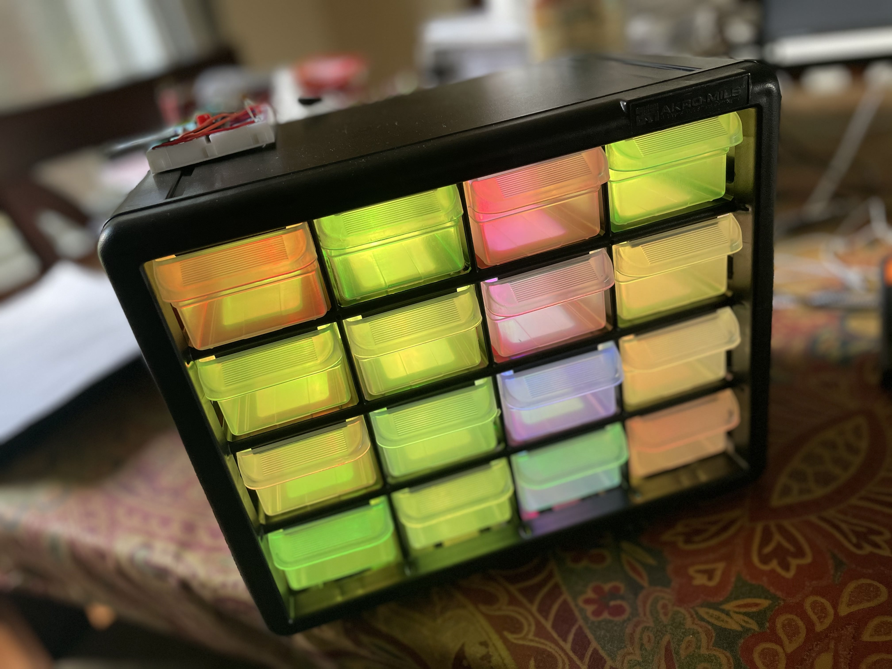
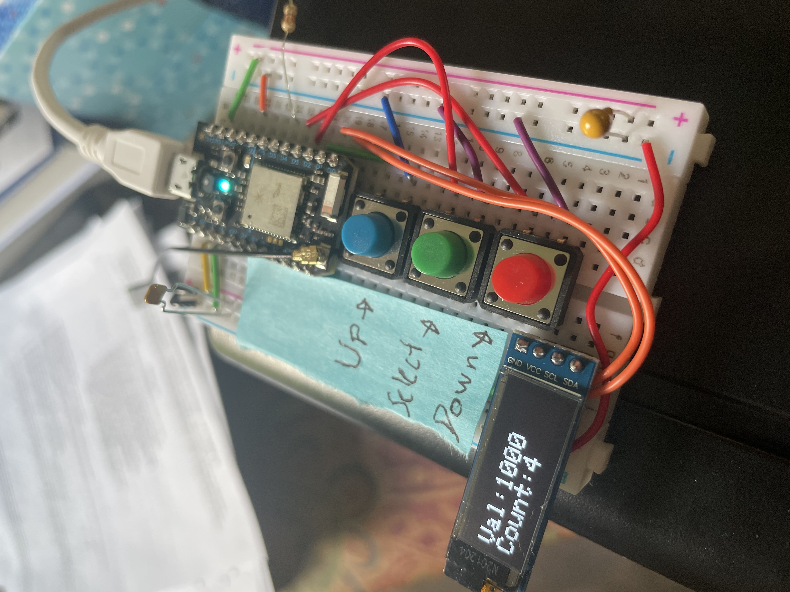
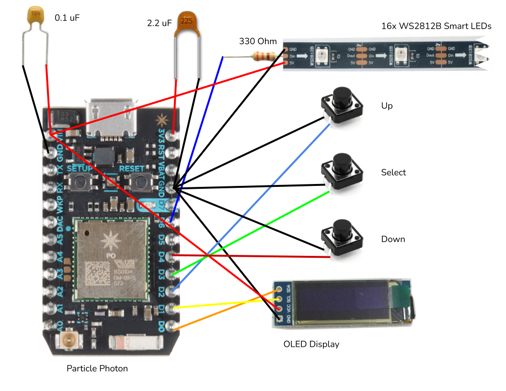

# Smart Resistor Storage

Finding the proper resistor from a bin is always a hassle, and you never know how many resistors of each value you have left. The goal of this project is to solve this problem by making a smart resistor storage device, powered by a Particle Photon controller. It consists of a storage drawer which will store resistors, LEDs in each drawer to indicate quantity and alert the user to where a resistor can be found, buttons and a screen to change the stored quantity of each resistor, and a web interface to select resistors and monitor the quantity of each resistor. 

## Sensors and actuators:

- LEDs in each drawer let the user know whether the drawer is empty or not (red = empty, yellow = low amount, green = good amount)
- 3 buttons, one to select a resistor value and the other two to add or subtract from the quantity of resistors
- I2C OLED screen which shows the currently selected resistor value and quantity

## Cloud connectivity:
- Able to track quantity of each resistor on a webpage
- Can input on a webpage a resistor value and an LED will change color to tell the user what drawer the resistor is in
- Can input on webpage how many resistors were added/removed to keep track of quantity
- Sends user an email throught IFTTT if quantity of resistors is below a certain amount

## BOM
- 1x Particle Photon
- 1x 0.1 uF Ceramic Capacitor
- 1x 2.2 uF Ceramic Capacitor
- 3x 12mm Push Button Switch
- 1x Particle Photon WiFi Antenna
- 1x 0.91 in I2C OLED Display - https://www.amazon.com/Pieces-Display-Module-SSD1306-3-3V-5V/dp/B08CDN5PSJ/
- 1x 330 Ohm Resistor
- 16x WS2812B Adressable LED Module - https://www.amazon.com/BTF-LIGHTING-WS2812B-Heatsink-10mm3mm-WS2811/dp/B01DC0J0WS
- 1x Akro-Mils 16 Drawer Storage Cabinet - https://www.amazon.com/Akro-Mils-10116-Hardware-10-5-Inch-8-5-Inch/dp/B003TV3NJ2/
- 1x 400 Point Breadboard - https://www.amazon.com/Breadborad-Solderless-Breadboards-Distribution-Connecting/dp/B082VYXDF1/

## Schematic
